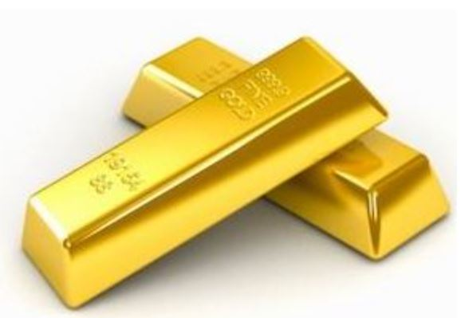
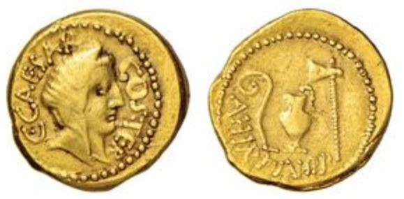
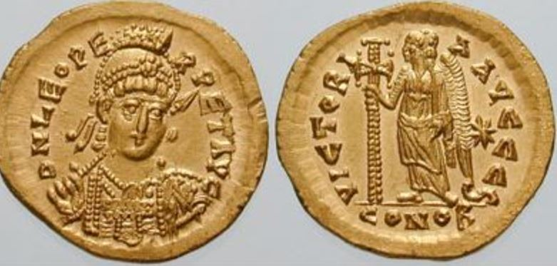

## Dall'Impero Romano al Rinascimento

A conclusione dell'articolo precedente avevamo evidenziato come i metalli divennero bene denaro utilizzato negli scambi commerciali. Questo perchè assolvevano a 4 proprietà fondamentali che deve avere un bene deputato all'uso come denaro:

1 Trasportabile 
2 Divisibile 
3 Indistruttibile 
4 Scarso 

## Il bene denaro per eccellenza: l'oro

L'oro è diventato il bene denaro piu richiesto perchè è un bene scarso in natura. La scarsità garantisce al bene di mantenere il suo valore nel tempo o addirittura di aumentarlo se la domanda aumenta, perchè non è possibile aumentare l'offerta. Un concetto semplice da capire ma non è compreso dai molti perchè portati ad utilizzare denaro fiat. fatto e regolamentato dallo stato sovrano. Come abbiamo già scritto nell 'introduzione. questa moneta oggi in forma elettronica semplifica moltissimo la nostra vita. Non è pero tutto oro quel che luccica e per capirlo cercheremo di ripercorrere la storia dell' oro.

## L'oro di Roma

La Repubblica Romana di Giulio Cesare utilizzava l’aureus come moneta di scambio, contenente un valore fisso di 8 gr d'oro. Questa moneta, ampiamente accettata in Europa e nel Mediterraneo, stimolò i commerci, favorì la specializzazione e portò stabilità economica per 75 anni.

Nel frattempo la conquista di nuove terre portava ricchezza nelle casse della repubblica, ricchezza che gli imperatori utilizzavano per acquisire popolarità e mantenere eserciti sempre più costosi. La popolazione rurale si trasferì nelle città dove la vita era migliore, lasciando le campagne incolte. Aumentava cosi il numero di persone improduttive che, per vivere, faceva affidamento sulla benevolenza dell'imperatore.
Le attività produttive venivano lasciate alle popolazioni conquistate e sottomesse Globalizzazione dell'antica Roma.
Quando però le terre da conquistare si esaurirono la repubblica si ritrovò a gestire un sistema molto oneroso e una popolazione improduttiva.

Nerone trovò il modo per "risolvere" i problemi finanziari dell'impero anticipando le teorie economiche di Johm Maynard Keynis: trasformò l'abitudine romana della limatura delle monete in attività istituzionale.
Le monete venivano sottratte alla popolazione e se ne coniavano di nuove con minor contenuto d’oro.

Il contenuto d'oro dell’aureus venne cosi ridotto da 8 a 7,2 gr. Questa pratica di svalutazione della moneta continuò sotto il regno di Caracalla riducendo il contenuto d'oro a 6,5 gr e con Diocleziano scese ulteriormente a 5,5. L'aureus venne poi sostituito da una nuova moneta, il solido contenente solo 4,5 gr di oro.

Le conseguenze furono devastanti: l'aumento della moneta in circolazione permetteva agli imperatori di aumentare le spese, ma svalutava la moneta aumentando il costo della vita. Il popolo, privato dalle proprie ricchezze e impoverito dall'aumento dei prezzi, si rifugiò nelle campagne diventando di fatto contadini autosufficienti destinati a diventare i futuri servi dei signori feudali. IL declino monetario portò con se quello fiscale, militare, culturale e spirituale.

**Nerone fu il precursore della teoria Keynesiana adottata da America e Gran Bretagna dopo la prima guerra mondiale.**

Nel 312 d.C., l'imperatore Costantino il Grande, iniziò a coniare grandi quantità di "solido", si impegnò a mantenere il suo valore invariato e trasferì la capitale a Costantinopoli. Roma decadde nel 476 d.C. mentre l'Impero Romano d'Occidente prosperò fino al 1453, quando fu conquistato dell'impero Ottomano. Il "solido" prese il nome di Bisante a seguire "dinaro islamico" e fu una delle monete più riconosciute e accettate al mondo. Il motivo è molto semplice: mantenere invariata la quantità d'oro a 4,5gr lo rese bene monetario stabile capace di preservare la ricchezza accumulata e di trasferirla nel tempo.

## Il periodo buio del Feudalesimo

Il feudalesimo fu la principale forma di organizzazione sociale che segui la caduta dell'Impero Romano. L'oro si concentrò nelle mani di pochi signori feudali e agli ex cittadini dell'Impero Romano, impoveriti dalla svalutazione dell'aureus, rimasero solo monete di argento, rame o bronzo, metalli facilmente svalutabili, quasi "denaro fiat". Il commercio, limitato dalla mancanza di un solido standard monetario trascinò la storia della civiltà nei secoli bui del medioevo.

## Il Rinascimento

La rinascita di una società prospera fu sancita dalle città stato. Nel 1252 a Firenze venne coniato Il fiorino, prima moneta d'oro europea, che rese i fiorentini liberi di lavorare, produrre, commerciare e accumulare ricchezza.
Alla fine del 1500 molte città e stati europei avevano seguito l'esempio di Firenze.
Un solido standard monetario è requisito fondamentale per la prosperità di un popolo

## Conclusione

Lo standard monetario di fatto divenne nella storia l'oro.

Il motivo per cui oggi non usiamo l'oro come mezzo di scambio è legato al  progresso tecnologico con I' invenzione del telegrafo nel 1837 e lo sviluppo capillare della rete ferroviaria. Il progresso portò ad un  utilizzo sempre maggiore di banconote sostituendo di fatto le monete di metallo più difficili da trasportare.

In questo modo, oro e argento potevano essere lasciati in custodia alla banca e ricevere in cambio banconote di egual valore. L'oro veniva cosi accumulato dalle banche e successivamente dagli stati con la creazione delle banche centrali sottraendolo alla sovranità individuale.

Le banconote risolvevano il problema della commerciabilità in scala delle monete metallo ma toglievano ricchezza alle persone. 

Ad onore di cronaca anche l'argento giocò un ruolo importante nella storia dell'umanità come bene denaro utilizzato nei piccoli pagamenti. L'utilizzo sempre più massiccio delle banconote, i nuovi strumenti finanziari utilizzati nei pagamenti e il progresso tecnologico che migliorò e aumentò l'estrazione di questo metallo aumentò di fatto l'offerta, deprezzandone il valore. Chi aveva accumulato ricchezza con l'argento subi' perdite molto importanti. Nazioni come India e Cina che usarono l'argento come riserva di valore rispettivamente fino al 1898-1935 subirono un deprezzamento della propria moneta rispettivamente del 56% e del 78% a differenza delle nazioni europee che invece utilizzarono l'oro come riserva di valore.

L'incapacità di queste due nazioni nel raggiungere livelli di prosperità simili a quelli occidentali è sicuramente legato alla distruzione di ricchezza causata dal deprezzamento dell'argento.

Non è possibile isolarsi dalle conseguenze economiche causate da chi detiene e utilizza forme di denaro sane, migliori.

Spesso Bitcoin viene denominato oro digitale per la sua scarsità intrinseca legata al codice che limita a 21000000 la quantità di Bitcoin coniabili.

Ha senso accumulare ricchezza in Bitcoin ?  Per rispondere a questa domanda bisogna conoscere Bitcoin e la tecnologia dietro a Bitcoin, le differenze con la moneta che utilizziamo tutti i giorni: il denaro Fiat.

Nel prossimo capitolo parleremo del controllo centralizzato e la nascita del denaro fiat.

Bibliografia

https://www.amazon.it/Bitcoin-Standard-Decentralized-Alternative-Central/dp/1119473861?&linkCode=sl1&tag=coindipity-21&linkId=230c1ec2b6c54129ed04b800039598ed&language=it_IT&ref_=as_li_ss_tl