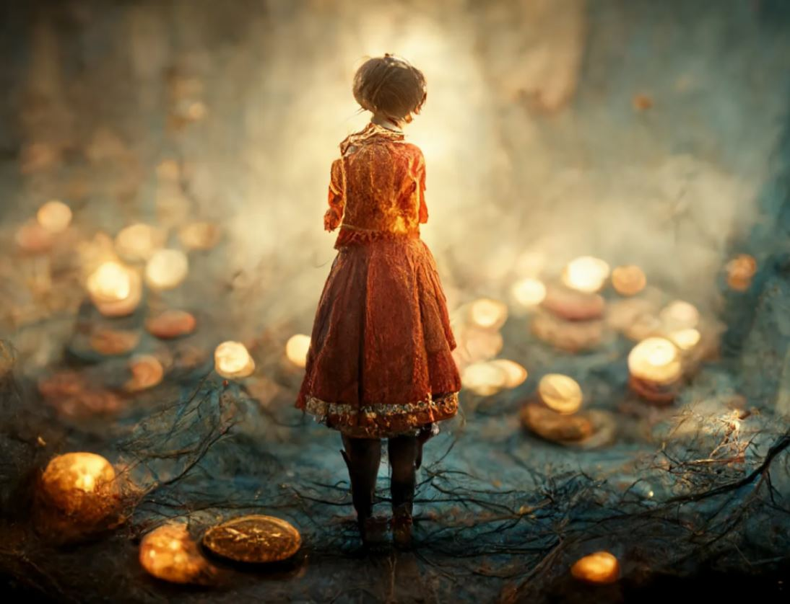

**Bitcoin è stato concepito per dare all'umanità la speranza di un futuro migliore.**
 Il percorso che mi ha portato a Bitcoin nasce da questa mia convinzione.

Quando nel lontano 2017 mio fratello Luca mi parlò di Bitcoin, lo ascoltai senza particolare interesse. Il lavoro e gli impegni familiari erano le mie priorità. Senza nemmeno pensarci molto, riposi Bitcoin nel cassetto delle  cianfrusaglie, per gettarlo nella spazzatura a tempo debito. 

Bitcoin non poteva fare parte della mia quotidianità fatta da un lavoro a tempo indeterminato, uno stipendio fisso, un mutuo, una casa e un conto corrente che gestiva le mie finanze e i miei risparmi dai quali dipendeva e dipende il mio futuro e il futuro dei miei cari.

Nella mia realtà non c'era spazio per un insieme di numeri  chiamati Bitcoin, perchè non potevo paragonarli a niente che fosse reale e tangibile. 
La svolta avvenne una anno dopo, quando lessi un articolo intitolato La scarsità digitale di Bitcoin, scritto da uno sviluppatore Bitcoiner Dergigi. 
Nel suo articolo Dergigi definisce Bitcoin un insieme di numeri calcolati spendendo energia, energia reale che ha un costo reale. 
Questo rendeva Bitcoin reale perchè non c'è modo di fare calcoli senza spendere energia; le leggi fisiche del nostro universo lo vietano.

Ok, immaginiamo per un attimo che Bitcoin sia reale come la banconota da 10€ che ho nel mio portafoglio ma qual'è la sua utilità ?

Questa domanda mi ha portato a colmare le lacune di conoscenza finanziaria con la lettura di un libro  per me molto importante: The Bitcoin Standard.

La mia sorpresa fu tale quando lessi che Bitcoin assolve alle funzioni di denaro meglio del denaro che usiamo ogni giorno e che la mia banconota da 10 .€ è meno reale di Bitcoin che dovetti rileggere il libro per la seconda volta.

Tutti questi argomenti li approfondiremo in una sezione dedicata del nostro Sito

Non mi ero mai posto la domanda su cosa fosse la moneta fino a quando non ho conosciuto Bitcoin.
Questo è il più bel regalo che Bitcoin potesse farmi.

## Alberto e Davide una passione in comune

Bitcoin ha invaso la rete. Tutti parlano di Bitcoin sia nel bene che nel male. Difficile farsi una propria idea, difficile fare una scelta che non significa "compro Bitcoin" ma semplicemente investo il mio tempo per conoscere Bitcoin.

Ho conosciuto Alberto e Davide ai SatoshiSpritz di Padova. 

Bitcoin mi ha regalato due nuovi amici. 

Insieme condividiamo la stessa visione di Bitcoin perchè vogliamo capire il mondo di oggi e viverlo da protagonisti.

Fa più rumore un albero che cade di una foresta che cresce
***Lao Tzu***

Mi piace pensare a Coindipity.com come a una foresta che cresce al di fuori del recinto, dove perdersi alla ricerca dell'ago nel pagliaio e dove ogni scoperta traccia il nostro sentiero della consapevolezza.

Benvenuti in Coindipity!