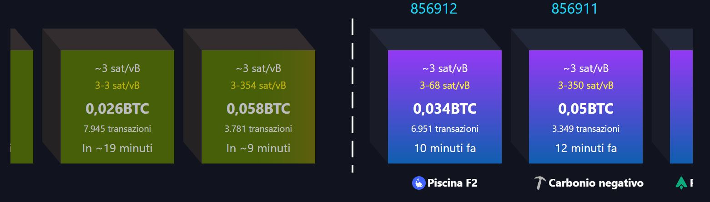
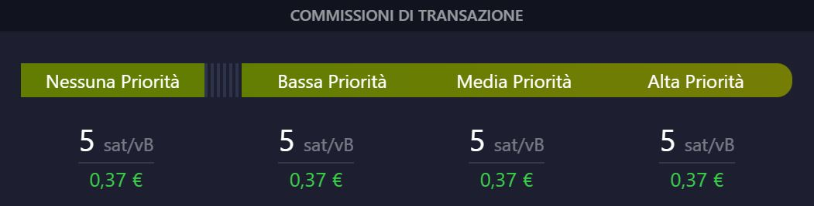
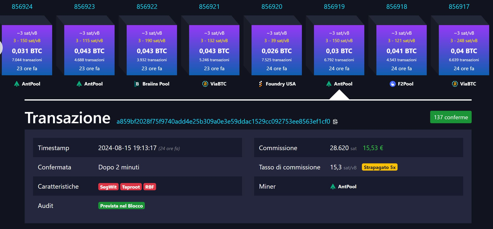

## Memory pool
Un mempool è la coda di transazioni in sospeso e non confermate di un nodo della rete.

## Mempool explorer

Un mempool explorer è uno strumento che consente di visualizzare informazioni storiche e in tempo reale sul mempool di un nodo.

I blocchi proiettati si trovano sulla sinistra della linea bianca tratteggiata, mentre i blocchi confermati si trovano sulla destra.

## vB e WU
Per misurare la dimensione delle transazioni e dei blocchi sulla rete Bitcoin vengono utilizzati byte virtuali (vB) e unità di peso (WU).

La dimensione di una transazione Bitcoin nella blockchain non è determinata dalla quantità di bitcoin trasferita, ma da fattori tecnici come il numero di input e output, il numero di firme e il formato utilizzato (legacy, SegWit, ecc.). Poiché lo spazio nella blockchain Bitcoin è limitato, le transazioni più grandi pagano commissioni di mining maggiori rispetto alle transazioni più piccole.

Le dimensioni dei blocchi sono limitate a 4.000.000 WU (o 1.000.000 vB poiché 1 vB = 4 WU).

In passato, le dimensioni delle transazioni e dei blocchi venivano misurate in byte semplici, ma sono stati ideati byte virtuali e unità di peso per mantenere la retrocompatibilità dopo l'aggiornamento di SegWit nel 2017.

## sat/vB
La priorità di una transazione Bitcoin in sospeso è determinata dal suo feerate o tasso di commissione. I feerate sono misurati in sat/vB.

Utilizzare un feerate sat/vB più alto per una transazione Bitcoin generalmente si tradurrà in una conferma più rapida rispetto all'utilizzo di un feerate più basso. Ma i feerate cambiano di continuo, quindi è importante controllare i feerate suggeriti subito prima di effettuare una transazione per evitare che si blocchi.

## a859bf2028f75f9740add4e25b309a0e3e59ddac1529cc092753ee8563ef1cf0

