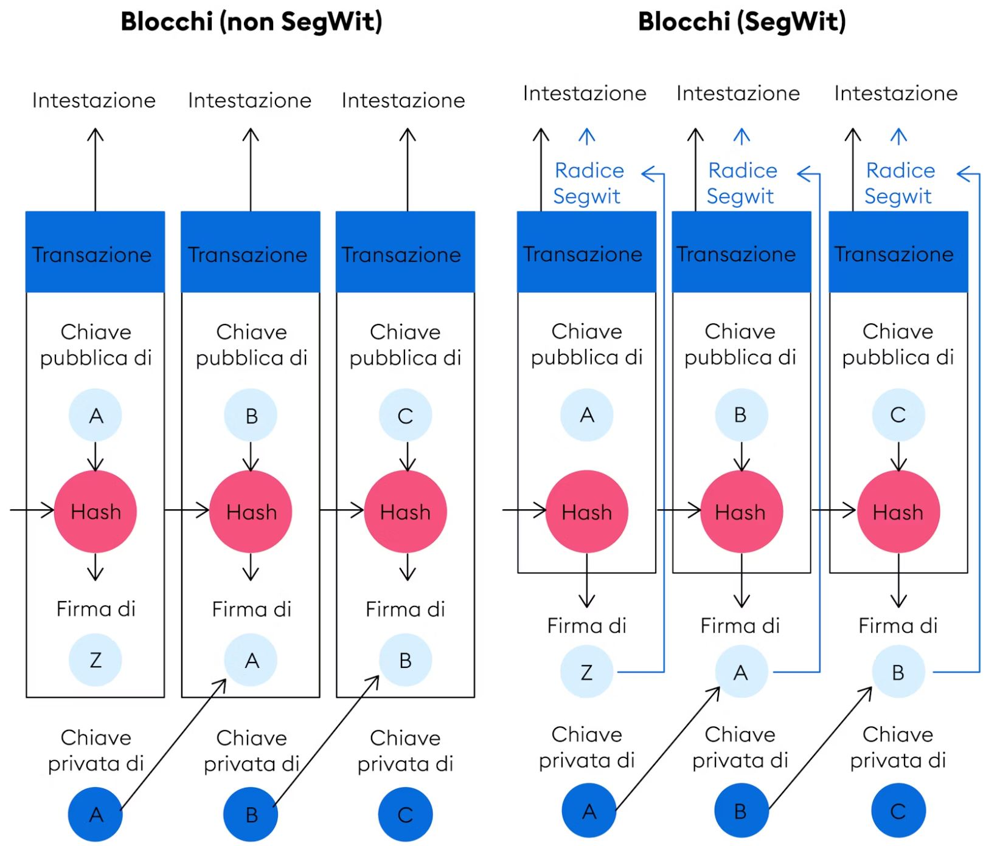

Segregated witness consensus layer", ovvero layer di consenso del testimone segregato, è stato introdotto il 24 agosto del 2017 con un soft fork. Obiettivo principale: aumentare la scalabilità tramite un aumento delle transazioni contenute in un blocco.

Con SegWit la transazione  è suddivisa in due componenti:
 * il primo che comprende gli indirizzi del portafoglio del mittente e del destinatario * il secondo che contiene le firme della transazione o i dati del testimone. 

I "dati del testimone" vengono rimossi dal blocco principale, riducendo notevolmente la dimensione delle transazioni. Così facendo, le transazioni richiedono meno spazio, permettendo di inserire più transazioni per blocco che, come sappiamo, ha uno spazio definito dal protocollo di 1 mb.

Inoltre, SegWit ha permesso di correggere una falla nel protocollo Bitcoin che permetteva agli utenti di cambiare gli hash delle transazioni. La modifica di un solo carattere in una firma digitale si traduce in un hash di transazione completamente diverso. Poiché la firma viene spostata dai dati della transazione ai dati del testimone segregato, non è più possibile cambiare l'ID della transazione. Perciò, SegWit è una soluzione alla modificabilità delle transazioni.

Cambia anche l’indirizzo degli address SegWit avendo come prima cifra il numero 3 e cambia  anche la tipologia degli address, passando alla P2SH: Pay to Script Hash.

 La versione definita Native Segwit cambia la tipologia di address in bech23: encoded with error detection e gli indirizzi si contraddistinguono per i primi 4 caratteri che sono sempre “bc1q“.

## SegWit abilita la rete Lightning
Uno dei progressi più rivoluzionari resi possibili da SegWit è stata l'integrazione di Lightning Network, una soluzione di secondo livello progettata per affrontare le sfide di scalabilità di Bitcoin. La Lightning Network promette velocità di transazione più elevate e commissioni ridotte creando canali di pagamento fuori catena tra le parti. Questo approccio innovativo consente di elaborare numerose transazioni al di fuori della blockchain principale di Bitcoin, registrando solo i saldi finali dei conti sulla catena. Il risultato è un sistema più efficiente e snello, in grado di gestire un volume maggiore di transazioni in una frazione del tempo.

Tuttavia, l'intero potenziale della Lightning Network non potrebbe essere realizzato senza l'attivazione di SegWit. Ciò è dovuto principalmente al fatto che la fondazione di Lightning Network faceva molto affidamento su transazioni bitcoin non confermate. Nello stato iniziale della rete Bitcoin, queste transazioni erano vulnerabili a un tipo di attacco chiamato "malleabilità delle transazioni". In sostanza, gli aggressori potrebbero alterare l’identificazione univoca di una transazione prima che venga confermata, creando discrepanze e potenziali scenari di doppia spesa.

Attivando SegWit, la comunità Bitcoin ha risolto questo problema di malleabilità delle transazioni. In tal modo, non solo ha rafforzato le difese della rete, ma ha anche aperto la strada all'implementazione sicura del Lightning Network. Senza il rischio di malleabilità delle transazioni, Lightning Network può funzionare senza problemi, garantendo che gli utenti possano effettuare transazioni con maggiore velocità, sicurezza ed efficienza in termini di costi.

## La dimensione del blocco e  il soft fork di segWit
 Le dimensioni dei blocchi sono semplicemente le dimensioni, in byte, del blocco serializzato (intestazione del blocco, numero di tx e le tx stesse). 
Come parte delle regole di consenso, ogni nodo sulla rete Bitcoin attualmente controlla che un blocco sia inferiore a 1.000.000 di byte. Vale a dire, un blocco che è maggiore di 1.000.000 di byte verrà rifiutato da questi nodi come regola di consenso.

Poiché i nodi legacy  rifiuteranno un blocco superiore a 1.000.000 di byte, qualsiasi soft fork deve mantenere questa regola. 
Ma come puoi aumentare la dimensione del blocco e mantenere comunque questa regola?

### Il Segreated Witness
 Una parte importante della transazione, lo scriptSig (firma, pubkey, ecc.), può non essere inviata ai nodi Legacy e comunque la transazione può essere considerato valida.

**BIP143**  definisce nuovi output di transazione che fanno esattamente questo. p2wpkh e p2wsh sono molto simili rispettivamente a p2pkh e p2sh, ma spostano i dati scriptSig alla fine della transazione.

Le transazioni non Segwit (definite come tx che spendono solo output non Segwit come p2pk, p2pkh e p2sh) mettono lo scriptSig al centro della transazione. 
Le transazioni Segwit (definite come tx che spendono almeno un output p2wpkh o p2wsh) mettono lo scriptSig alla fine. La parte scriptSig delle transazioni Segwit è chiamata "dati testimone". 

Quando le transazioni Segwit vengono inviate ai nodi Legacy,  i dati testimone vengono eliminati.  La chiave è che queste transazioni "eliminate" sono ancora transazioni valide sui nodi Legacy, il che ci consente di risparmiare rispetto alle transazioni non Segwit.  Pertanto, più transazioni possono essere inserite nel blocco inviato ai nodi Legacy senza superare il limite di 1.000.000 di byte.

I nodi Segwit ottengono transazioni e blocchi Segwit che  includono  i dati witness utilizzando messaggi di rete alternativi. I nuovi messaggi di rete sono definiti in  **BIP144**  come parte di Segwit. I blocchi Segwit  che includono i dati witness  possono essere più grandi di 1.000.000 di byte. I nodi legacy, come detto, ricevono gli stessi blocchi e transazioni, ma con i dati witness rimossi. Questo è un modo per rendere Segwit un soft fork.

## Il Block Weight 

I blocchi Segwit sono limitati da qualcosa chiamato  Block Weight . Block Weight è un nuovo concetto introdotto in Segwit, ed è calcolato su base per transazione. Ogni transazione ha un "peso" che è definito in questo modo:

(dimensione transazione con i dati dei testimoni rimossi) * 3 + (dimensione tx)

il Block Weight utilizza un sistema di misurazione più sfumato, basandosi su unità di peso. In questo sistema, un byte di dati non testimone di una transazione equivale a 4 unità di peso, mentre un byte di dati testimone equivale a solo 1 unità di peso. Con un limite fissato a 4 milioni di unità di peso per un blocco, un blocco riempito esclusivamente con transazioni non SegWit osserverebbe comunque la precedente limitazione di 1 milione di byte.

**Questo innovativo metodo di misurazione garantisce che l'incremento della dimensione del blocco rimanga coerente con i principi di un soft fork.**

Il peso delle transazioni non-Segwit è direttamente proporzionale alla dimensione. Le transazioni non-Segwit da 1000 byte avranno sempre un peso di 4000, indipendentemente da cosa sia composta la transazione.

 Le transazioni Segwit da 1000 byte possono avere molti pesi diversi a seconda di quanta parte della transazione è occupata dai dati Witness. Considerate due transazioni diverse:

Una transazione Segwit da 1000 byte con 500 byte di dati di controllo
Una transazione Segwit da 1000 byte con 300 byte di dati di controllo.

La prima avrebbe un peso di 500*3+1000=2500 

la seconda avrebbe un peso di 700*3+1000=3100. 

Allo stesso modo, transazioni di dimensioni diverse possono avere lo stesso peso. Considera 3 transazioni diverse:

Una transazione Segwit da 800 byte con 400 byte di dati Witness
Una transazione Segwit da 1100 byte con 800 byte di dati Witness
Una transazione Non-Segwit da 500 byte
Tutte queste transazioni hanno esattamente lo stesso peso di 2000. 
Quando serializzate su un nodo Legacy, saranno rispettivamente di 400 byte, 300 byte e 500 byte (dimensione tx senza dati witness). 
Quando serializzate su un nodo Segwit, saranno rispettivamente di 800 byte, 1100 byte e 500 byte.

A questo punto, potresti chiederti quanti dati Witness saranno presenti in una tipica transazione Segwit. In linea di massima, le transazioni Segwit sono circa 2/3 dati Witness.

## Nuovi tipi di script di SegWit

Uno script Bitcoin è un semplice linguaggio di programmazione basato su stack "last in first out" utilizzato nella rete Bitcoin per definire le condizioni che devono essere soddisfatte affinché una transazione possa essere eseguita. In pratica, uno script Bitcoin specifica come e quando i Bitcoin possono essere spesi.

* P2PKH (Pay-to-PubKey-Hash): Il tipo di script più comune, richiede una firma e una chiave pubblica che corrispondono all'hash.
* P2SH (Pay-to-Script-Hash): Permette l'uso di script più complessi, referenziati tramite il loro hash.

* P2WPKH Pay-to-Witness-PubKey-Hash
Prima dell'incorporazione di SegWit, lo script maggiormente utilizzato era il Pay-to-Pubkey-Hash (P2PKH), un meccanismo che ancorava effettivamente bitcoin all'hash di una chiave pubblica. P2WPKH, un'innovazione di SegWit, rispecchia le funzionalità di P2PKH con una sottile variazione. Nello scenario di spesa di un output P2WPKH, i componenti essenziali – la firma e la chiave pubblica – sono sistemati in modo sicuro nel Witness. Nel frattempo, lo ScriptSig rimane intatto. Questa mossa strategica mira a scongiurare la potenziale malleabilità nell’ID della transazione.

* Pay-to-Witness-Script-Hash (P2WSH)
Dopo P2PKH, Pay-to-Script-Hash (P2SH) ha guadagnato terreno come tipo di script legacy di spicco. Consente agli utenti di inviare bitcoin a un hash di script univoco e arbitrario, soprannominato redimeScript. Chiunque sia dotato di questo riscatto e soddisfi i criteri stabiliti, può recuperare questo bitcoin.

## Indirizzo Legacy
La prima tipologia di address Bitcoin mai creata si chiama Legacy. 
Gli indirizzi di tipo Legacy si contraddistinguono dal primo carattere dell’address che comincia sempre col numero “1” e utilizzano una tipologia di address definita P2PKH, acronimo di Pay to Public Key Hash.