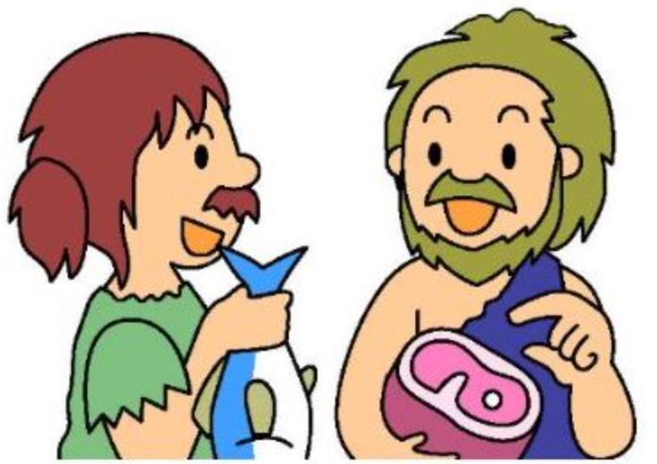
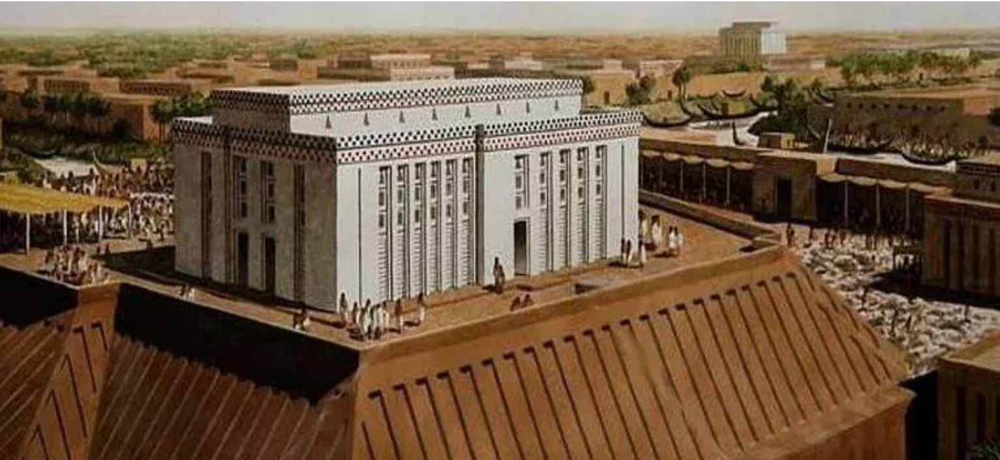
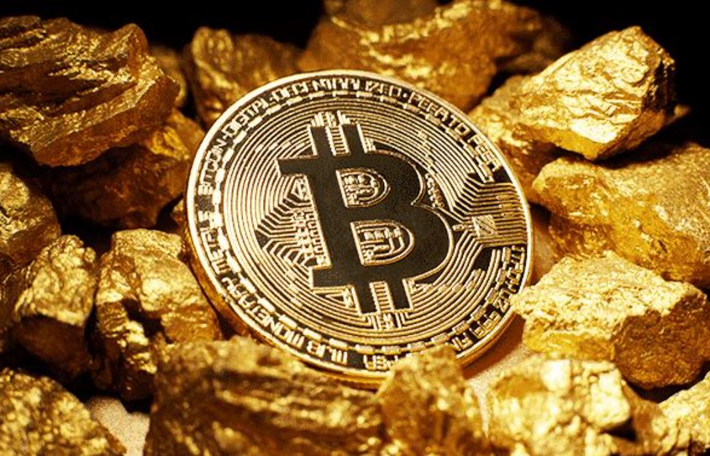

code Il Sicuramente avrete sentito parlare di Bitcoin, del movimento cypherpunk e della scuola di economia austriaca e probabilmente avrete pensato che bitcoin sia un qualcosa che non appartiene al mondo reale, un qualcosa per pochi. I concetti che supportano bitcoin sono antichi come la storia della nostra terra e sono le basi della nascita del denaro sano e onesto.

Presto o tardi dovremo fare i conti con bitcoin, per  farlo dovremo conoscerlo.  Questo è solo l’inizio di una rivoluzione epocale.

Bitcoin è stato pensato per svolgere la funzione di denaro, denaro sano, denaro digitale. Riceviamo e spendiamo denaro ogni giorno, in forma cartacea o elettronica, delegando a terze parti il compito di gestirlo.

Ma cos’è  il denaro e quali funzioni svolge ? E, soprattutto, chi gestisce il nostro denaro e come ? Per conoscere Bitcoin cercheremo di rispondere a queste domande con la nostra serie intitolata Perchè Bitcoin.

Buona lettura

## Il baratto

Agli albori della civiltà, l’essere umano usava lo scambio di beni conosciuto anche come baratto per soddisfare i propri bisogni. 

Immaginiamo due persone: una ha della carne e l'altra ha del pesce. La carne ha più valore per la persona che ha il pesce, e il pesce ha più valore per la persona che ha la carne. Le due persone possono quindi concordare di scambiare la carne con il pesce.

Il baratto ha però un grosso limite; il problema della coincidenza dei bisogni o beni che lo rende inefficiente e non incentiva la specializzazione del singolo e la crescita economica. Se il bene di una delle due parti non corrisponde al desiderio della controparte o viceversa, lo scambio non avviene. Il baratto è inefficiente per la crescita di una economia perchè non incentiva le persone a specializzarsi.

Nel baratto è necessario trovare una controparte che abbia ciò che si desidera ed è interessata a ciò che si offre.

## Dal baratto alle prima forme di commercio

Le prime economie agricole non erano basate sul baratto, ma su un sistema di debito e credito.
Era naturale indebitarsi al momento della semina e ripagare dopo il raccolto. 

Di fatto, le prime istituzioni economiche furono le autorità religiose, incaricate di gestire questo sistema di debito e credito.
Templi e palazzi della prima Mesopotamia, Egitto e Creta funzionavano come banche nazionali, prelevando e redistribuendo una quota dei raccolti.
Questo, se da un lato permise la specializzazione con lo sviluppo di attività diverse dall'agricoltura, dall'altro portò alla nascita di un oligarchia finanziaria dove pochi gestivano le ricchezze di molti ovviamente a proprio vantaggio.

Nel corso dell’antichità i templi erano i principali banchieri della società e fonti di denaro in caso di emergenza.
Le statue sacre erano abbellite con ornamenti d'oro che potevano essere fusi in caso di necessità, per esempio pagare mercenari in caso di guerre.

I sovrani, per ridistribuire le ricchezze accumulate dai pochi e ristabilire il loro controllo sulle economie nazionali, proclamavano regolarmente giubilei, celebrazioni religiose attraverso le quali cancellavano i debiti privati, liberavano le persone in schiavitù del debito, ripristinavano terre e proprietà ai loro proprietari originali riavviando cosi il ciclo economico.

## Il bene di mercato come bene di scambio: la nascita del denaro

Con lo sviluppo del commercio e l'apertura verso altri mercati, definire il valore dei beni scambiati era praticamente impossibile. Palazzi e Templi della Mesopotamia introdussero grano e argento come punti di riferimento per assegnare un valore ai beni frutto delle transazioni. Utilizzavano cioè un bene intermediario nello scambio.

Nel tempo il metallo è emerso come bene preferito dai produttori e dai commercianti quando barattavano tra loro raccolti e prodotti artigianali diventando di fatto un bene utilizzato anche come moneta.
**Per moneta si intende quindi quel bene deputato a misurare il valore della merce scambiata.**

(Aristotele, Politica, I, 1257a) “…Quando, per soddisfare i bisogni si cominciò a fare ricorso a fonti straniere importando le cose mancanti ed esportando quelle in eccesso, entrò necessariamente in uso una moneta. Infatti non tutte le cose per natura necessarie erano di facile trasporto: perciò per facilitare gli scambi si convenne di dare e accettare un qualcosa che, oltre ad essere utile di per sé, possedesse il vantaggio di essere facilmente impiegabile per le necessità della vita, come il ferro o l’argento o anche qualche altro materiale, dapprima definito semplicemente nella sua dimensione e nel suo peso, poi con l’impressione di un carattere, che potesse dispensare dall’effettuare la misurazione, e che servisse da marchio indicante la quantità…”

(Aristotele, Etica Nicomachea, V, 1133)
“…Tutto ciò che è oggetto di scambio deve essere in qualche modo commensurabile. A questo scopo è stata inventata la moneta, che è divenuta una sorta di termine medio, dato che misura tutto.
Misura sia l’eccesso sia il difetto e quindi anche quante scarpe siano uguali a una casa o a del cibo; quindi è necessario che, come un architetto sta a un calzolaio, così questa precisa quantità di scarpe stia a una casa o a una certa quantità di cibo; se non vi è commensurabilità, non si possono avere né scambio né associazione.
Quindi è necessario che tutto venga misurato con un qualcosa di unitario, come abbiamo già detto prima. Questo, in verità, è il bisogno, che tiene unita la comunità; se infatti non vi fosse bisogno di nulla, o se non vi fosse bisogno in modo comparabile, lo scambio non avrebbe luogo o non sarebbe lo stesso; perciò la moneta è diventata un sostituto del bisogno per accordo comune e per questo ha il nome di moneta, perché non è per natura ma per convenzione e dipende da noi modificarla o porla fuori corso…”
“…Se in un certo momento non abbiamo bisogno di nulla, la moneta è una sorta di garanzia che gli scambi saranno possibili anche in futuro, quando saranno necessari. Anche la moneta subisce l’inconveniente di non avere sempre lo stesso potere d’acquisto; tuttavia il suo valore tende a rimanere piuttosto stabile…”.

## La scelta del bene come mezzo di scambio

Quando parliamo di riserva di valore parliamo di commerciabilità nel tempo. Dato per assodato che il bene denaro mantenga la sua integrità fisica nel tempo, dobbiamo concentrare la nostra attenzione alla sua inelasticità. Un bene è inelastico quando la quantità offerta di quel bene non aumenta all'aumentare della domanda.
Se all'aumentare della domanda nessuno riuscirà ad aumentare l'offerta, il bene manterrà o addirittura aumenterà il suo valore.
In un mercato libero il valore di un bene dipende dalla domanda e dall'offerta.
Durante la pandemia in America la carta igienica andò a ruba. Il prezzo sali nell'immediato ma poi scese gradualmente perchè i produttori di carta igienica aumentarono la produzione cosi da soddisfare le richieste del mercato.
La domanda di un bene denaro, aumenta con la crescita economica di un paese perchè le persone producendo ricchezza, hanno la necessitò di custodirla.
Il bene denaro scelto per custodire ricchezza deve avere un meccanismo naturale o artificiale che ne limiti la produzione, cosi da mantenere e aumentare il suo valore nel tempo.
In caso contrario un bene denaro di facile produzione, distrugge la ricchezza prodotta e impoverisce le persone.
Nel tempo La conseguenza sarà che le persone sposteranno la loro ricchezza verso altri beni denaro più efficienti. Nasceranno altre forme di denaro più efficienti.

**I cicli della storia umana sono legati alla inelasticità del bene scelto come denaro.**

Le civiltà sono fiorite e prosperate in tempi e luoghi dove veniva utilizzato denaro inelastico, denaro sano e onesto, al contrario, denaro svilito e corrotto ha accompagnato il loro declino.
Questo perchè il denaro sano stimola le persone ad avere una bassa preferenza temporale. Esiste oggi una specie di competizione monetaria di libero mercato che ci permette di scegliere un bene denaro.
Può essere oro, argento, un immobile, valuta straniera, Bitcoin……

**Laddove nasce un denaro sano, libero, condiviso ed accettato da tutti vi è prosperità e progresso.**

## Come il denaro determina la preferenza temporale

Il bene denaro in grado di conservare il proprio valore nel tempo, incentiva gli individui a pianificare meglio il proprio futuro e ne abbassa le preferenze temporali.

La preferenza temporale è il rapporto con cui gli individui valutano il presente rispetto al futuro. Il bene disponibile nel presente ha un valore maggiore di un bene disponibile nel futuro. L'essere umano non vive in eterno e il futuro è per sua stessa natura incerto.

Io posso rinunciare a un determinato bene nel presente solo in cambio di una maggiore quantità da riceversi in futuro.

**La mia capacità di rinunciare oggi per il futuro determina la mia preferenza temporale.**

## Io-Presente contro Io-Futuro

Ogni giorno, un individuo effettua un gran numero di transazioni economiche con altre persone ma, in realtà, fa i conti con un numero molto più grande di scelte economiche in relazione al proprio futuro.
Gli esempi concreti di queste decisioni sono infiniti:

decidere di risparmiare piuttosto di spendere;

decidere di investire nell’acquisizione di competenze per impieghi futuri anziché accettare un posto di lavoro con un salario basso;

comprare un’auto economica ma funzionale senza doversi indebitare per una costosa;

fare gli straordinari rinunciando all’aperitivo con amici;

e infine la nostra preferita, decidere di dedicare parte del tuo tempo alla conoscenza di Bitcoin.

**Il denaro può determinare la mia preferenza temporale.**

## Conclusioni

Nelle società economicamente evolute il  baratto è inefficiente perchè non risolve il problema della non coincidenza dei bisogni. La soluzione è nel definire un bene che funga da intermediario nello scambio di altri beni. Questo bene prende il nome di denaro.

Il denaro è:
* inelastico 
* riserva di valore 
* unità di conto 

Un bene denaro inelastico incentiva le persone ad usarlo come riserva di valore.

Un bene denaro elastico incentiva i consumi e il debito.

Bibliografia

[Palatial credit origins of money and interest](https://michael-hudson.com/2018/04/palatial-credit-origins-of-money-and-interest/)

[Shelling out](https://nakamotoinstitute.org/library/shelling-out)

[The bitcoin standard](https://shop.usemlab.com/home/85-the-bitcoin-standard-edizione-italiana.html)
